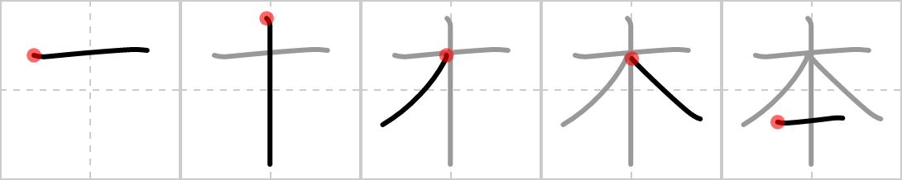

# KanjiVG to PNG

**kanjivg-to-png** converts [KanjiVG] SVGs into a single PNG that shows how
each Kanji is drawn, stroke by stroke.

## Showcase

This is what the SVG for the Kanji 本 looks like:


The following example shows how the Kanji 本 is drawn stroke by stroke:



Pre-generated PNGs can be found under the [Releases] tab on GitHub.

## Installation

This tool is designed to work in conjunction with the various helper scripts
provided by this repository. It is recommended that you clone the repository
and install the application locally:

```bash
git clone --depth=1 -- https://github.com/nicdgonzalez/kanjivg-to-png
cd kanjivg-to-png
cargo install --path .
```

## Get KanjiVG data

First, download the Kanji data from KanjiVG, which can be found under the
**Releases** tab of the official [KanjiVG/kanjivg] repository on GitHub.

Or run the following command to automatically download the latest release:

> [!TIP]\
> Piping directly to bash can be risky because it prevents you from reading the
> code that will run on your system. Always inspect scripts before executing
> them to ensure they are safe.
>
> You can inspect the script used below [here](./scripts/get-kanjivg-data.sh).

```bash
curl -SsL https://raw.githubusercontent.com/nicdgonzalez/kanjivg-to-png/refs/heads/main/scripts/get-kanjivg-data.sh | bash
```

Alternatively, you can clone the repository and run:

```bash
git clone --depth=1 -- https://github.com/nicdgonzalez/kanjivg-to-png
cd kanjivg-to-png
bash ./scripts/get-kanjivg-data.sh
```

## Usage

**Tested with**:

- KanjiVG r20250816
- cargo 1.87.0
- Python 3.13.7

Other recent versions may also work.

### Intended usage

This program wasn't designed to be run directly. Instead, run the following
helper script to automatically generate PNGs for all of the SVGs:

```bash
python3 ./scripts/main.py --input ./kanji --output ./kanji_output 2> error.log
```

On most systems, this should complete in under a minute. Once complete, all of
the PNGs should be available in `./kanji_output`. Any errors that occurred
should appear in `error.log`.

### Minimal example

A minimal example to convert a single KanjiVG SVG into a PNG:

```bash
# "0672c" corresponds to the Kanji 本 (I explain how I got that later).
kanjivg-to-png --input ./kanji/0672c.svg --output ./0672c.png
```

### Detailed example

KanjiVG stores the SVGs using the Kanji's unicode value in hexadecimal format
(plus a leading zero). To get a Kanji's hexadecimal unicode value, you can use
the following command:

```bash
python3 -c 'print(hex(ord("本")))'  # prints: 0x672c
```

The following is the same as before, but in a slightly more useful way:

```bash
kanji="$(python3 -c 'print(hex(ord("本")).replace("0x", "0"))')"
input="$PWD/kanji/$kanji.svg"
output="$PWD/output/$kanji.png"

mkdir --parents "$(dirname "$output")"
kanjivg-to-png --input "$input" --output "$output"
```

## Development

Here are some tips if you want to modify how the SVGs are parsed or rendered:

- The main entry point is [src/main.rs](./src/main.rs).
- I recommend opening a few SVG files and getting familiar with its contents
  (it is XML-based, which is similar to HTML).
- To create custom SVG elements, see `create_background` in
  [src/main.rs](./src/main.rs).
- To test your changes, run:
  ```bash
  # Set these up once, then re-use the final command.
  kanji="$(python3 -c 'print(hex(ord("本")).replace("0x", "0"))')"
  input="$PWD/kanji/$kanji.svg"
  output="$PWD/debug.png"

  cargo run -- --input "$input" --output "$output" && xdg-open "$output"
  ```

## License

This project is released under the [CC BY-SA 3.0 License], in accordance with
the license of the KanjiVG data it modifies. See [LICENSE](./LICENSE).

## Attributions

This project uses and modifies Kanji SVG files from [KanjiVG], which is ©
2009–2011 Ulrich Apel and licensed under the [CC BY-SA 3.0 License].

[cc by-sa 3.0 license]: http://creativecommons.org/licenses/by-sa/3.0/
[kanjivg]: http://kanjivg.tagaini.net
[kanjivg/kanjivg]: https://github.com/KanjiVG/kanjivg/releases
[releases]: https://github.com/nicdgonzalez/kanjivg-to-png/releases
